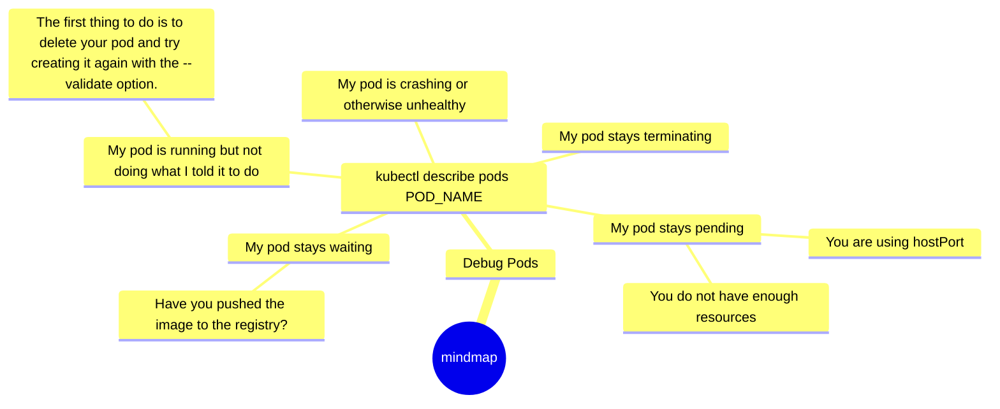

## Introduction

> Only half of the programming is coding. The other 90% is debugging.
> 
> Anonymous.

> Kernighan's Law: 
> 
> Debugging is twice as hard as writing a program in the first place. So if you're as clever as you can be, when you write it, how will you ever debug it? 

People say: “You build it! And you own it!” but in the modern IT world, it is easy to write yamls and apply them to k8s, right? But it does not not always work as expected, doesn’t it?

You can find tons of books and tutorials on how to do it correctly. But the reality is that there are no manuals on how to write apps that are easier to debug and troubleshoot in k8s. How can the design and construction of k8s resources be improved to avoid bugs?

In this blog post, I’ll try to show you how to a deal with the most common errors while deploying to k8s, different strategies and methods for troubleshooting and how to debug your apps inside the cluster.

I’ll show the most valuable tools you can use to speed up your debugging skills in RBACs, NetworkPolices and Nodes, volumes, and pods. Also, we discuss high-level strategies and methods for addressing diverse k8s failures and specific techniques to apply when writing, using, and running your projects inside k8s to make programs more accessible to debug.

## History of debugging

> Engineers and programmers have long used the term "bug" for faults in their systems – as if it were something that crept into an otherwise flawless program to cause the effects that none could explain. And from a psychological standpoint, it is far easier to blame some "bug" rather than taking responsibility ourselves. In the end, though, we have to face the fact: We made the bugs, and they are ours to fix.

> Having said that, there has been one recorded instance where a real bug has crept into a system. That was on September 9, 1947, when a moth got stuck in the relay of a Harvard Mark II machine. This event was logged, and the log book is now on display at the Smithsonian Natural Museum of American History, as "First actual case of bug being found."
> 

## Debugging on dev machine

TBD

## What is k8s?

Tl;dr: 
Kubernetes allows us to run and schedule containerized workloads on multiple hosts. Keep this primary capability in mind as we dive deeper.

## Define a problem:

Pods are the most minor deployable units of computing that you can create and manage in Kubernetes.

Since we did all the groundwork - 
Now, let’s focus on how to debug the go app inside k8s. 
I assume you know some basic how to check state etc. So I will focus only on debugging running PODS.

## Debug Pods

## Debug Init containers
For debugging the outcome of init containers, it helps if the command of the application container is replaced temporarily with a dummy sleep command so that you have time to examine the situation. This trick is particularly useful if your init container fails to start up and your application fails to start because the configuration is missing or broken. The following command within the Pod declaration gives you an hour to debug the volumes mounted by entering the Pod with kubectl exec -it <pod> sh:

## Few words about custom debug container